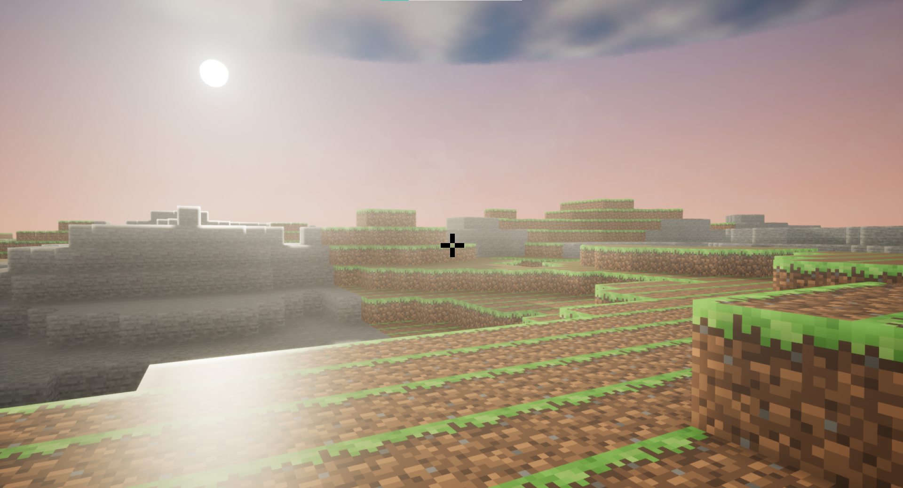
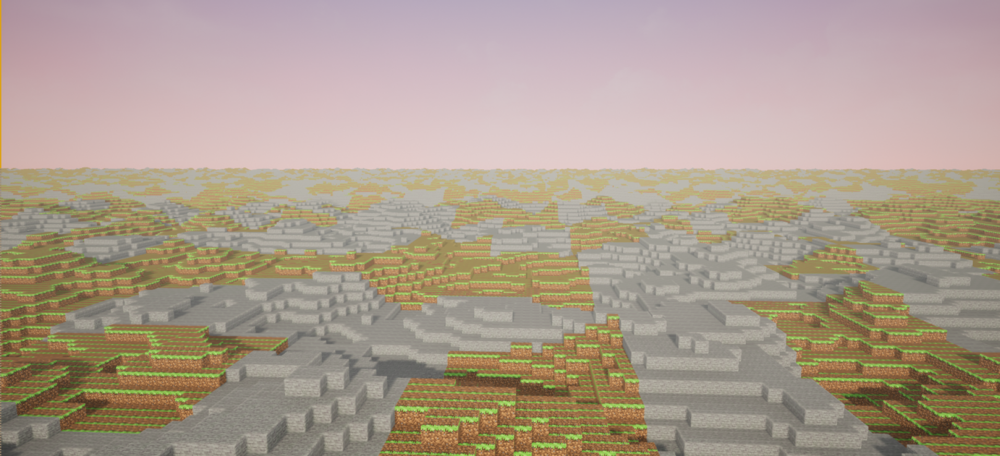
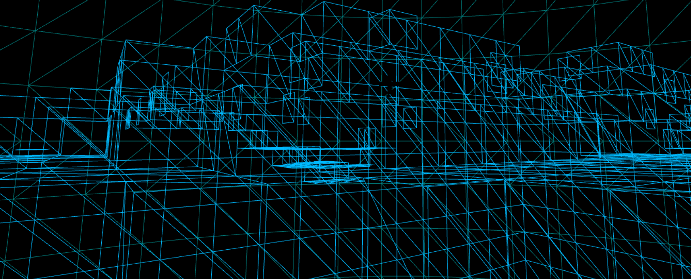

---

title: Gameplay/C++ Programmer

---

- [About Me](#about-me)
- [Portfolio](#portfolio)
  - [UEVoxelCraft](#UEVoxelCraft-[Github-Repository](https://github.com/Shayan-Zamiri/UEVoxelCraft))
  - [CyberEngine](#CyberEngine-[Github-Repository](https://github.com/Shayan-Zamiri/CyberEngine))
  - [RTS formation and movement with UE5 Mass(ECS)](#RTS-formation-and-movement-using-UE5-Mass(ECS))
- [CV](#cv)
- [Contact Me](#contact-me)

# About Me

UE4/C++ programmer with three years of experience working in my indie game studio. I can solve technical and mathematical problems, and by using my knowledge of software and hardware, I try to create optimized and satisfying features with good architecture.

# Portfolio

## UEVoxelCraft-[Github-Repository](https://github.com/Shayan-Zamiri/UEVoxelCraft)

- Procedural Generation based on RuntimeMeshComponent and FastNoiseLite library, it's highly optimized and only renders faces that touch the air and aren't hidden.
- Inventory System based on Datasets/Asset Manager with load system and also uses flyweight pattern.
- Blocks can be removed and added by character and chunks will be updated.
- WorldGenerator always generates chunks up to custom distance  from character and removes far chunks.

 
 
 
<video width=720 controls> <source src="Videos/UEVOXELCRAFT1.mp4" type="video/mp4"></video>

## CyberEngine-[Github-Repository](https://github.com/Shayan-Zamiri/CyberEngine)

- Import and render 3D obj files
- ImGUI UI
- CMake
- C++

<video width=720 controls> <source src="Videos/Cyber Engine.mp4" type="video/mp4"></video>

## RTS formation and movement using UE5 Mass(ECS)

- Data-Oriented RTS formation and movement using UE5 Mass plugin(Entity Component System)

<video width=720 controls> <source src="Videos/RTS formation and movement.mp4" type="video/mp4"></video>

# CV

   [Download-pdf](https://github.com/Shayan-Zamiri/Shayan-Zamiri.github.io/blob/main/ShayanZamiri_CV_GameplayProgrammer.pdf)

# My Youtube Channel

  [Cyborg Dev](https://www.youtube.com/channel/UCj7xbRxsGHx2bOdgvpKr3mw)

# Contact Me

- [GitHub](https://github.com/Shayan-Zamiri)
- [Twitter](https://twitter.com/Shayan_Zamiri)
- <shayan.zamiri@gmail.com>
