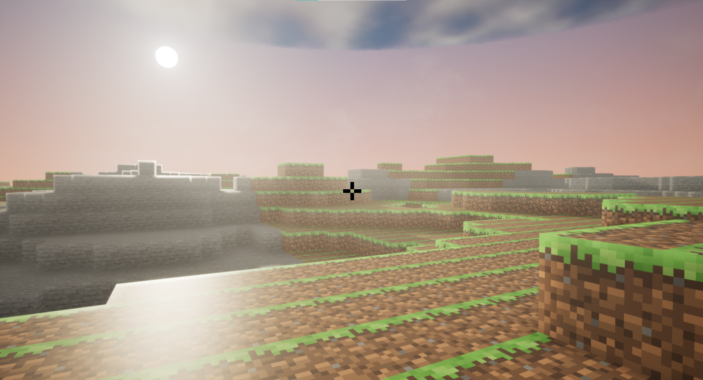
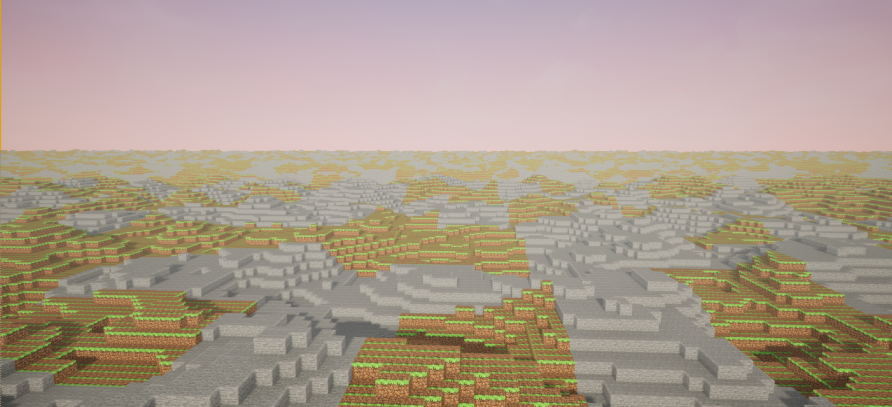
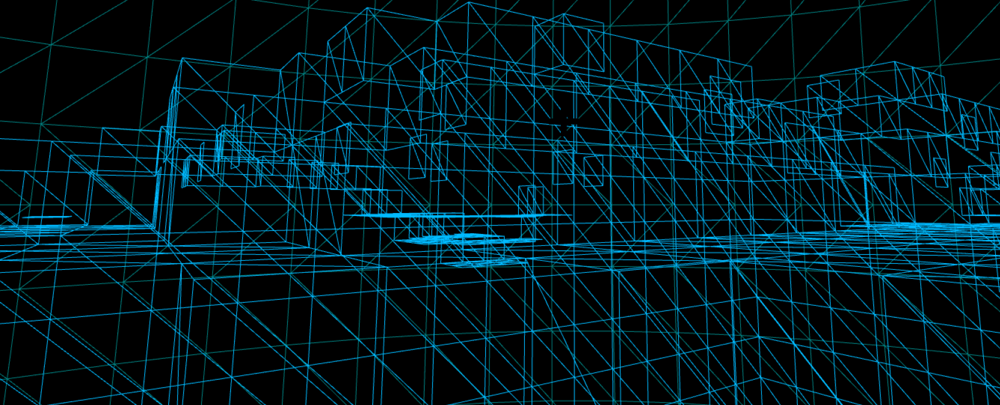

---

title: Gameplay/C++ Programmer

---

- [About Me](#about-me)
- [Portfolio](#portfolio)
  - [UEVoxelCraft](#uevoxelcraft)
- [CV](#cv)
- [Contact Me](#contact-me)

# About Me

  UE4/C++ programmer with three years of experience working in my indie game studio. I can solve technical and mathematical problems. By using my deep knowledge of software and     hardware, I try to create optimal and satisfying features with good architecture.

# Portfolio

   ## UEVoxelCraft

    
    
    

<video width="1280" height="720">
<source src="Videos/UEVOXELCRAFT1.mp4" type="video/mp4">
</video>

# CV

   [Download-pdf](https://github.com/Shayan-Zamiri/Shayan-Zamiri.github.io/blob/main/ShayanZamiri_CV_GameplayProgrammer.pdf)

# Contact Me

   -[GitHub](https://github.com/Shayan-Zamiri)
   -[Twitter](https://twitter.com/Shayan_Zamiri)
   -<shayan.zamiri@gmail.com>
